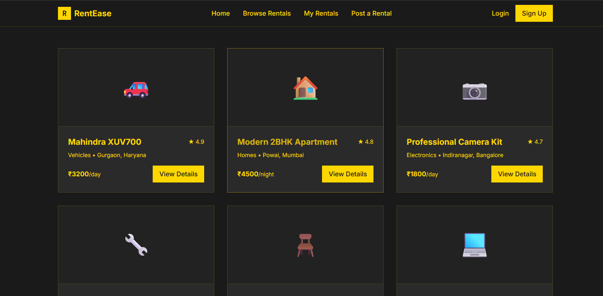
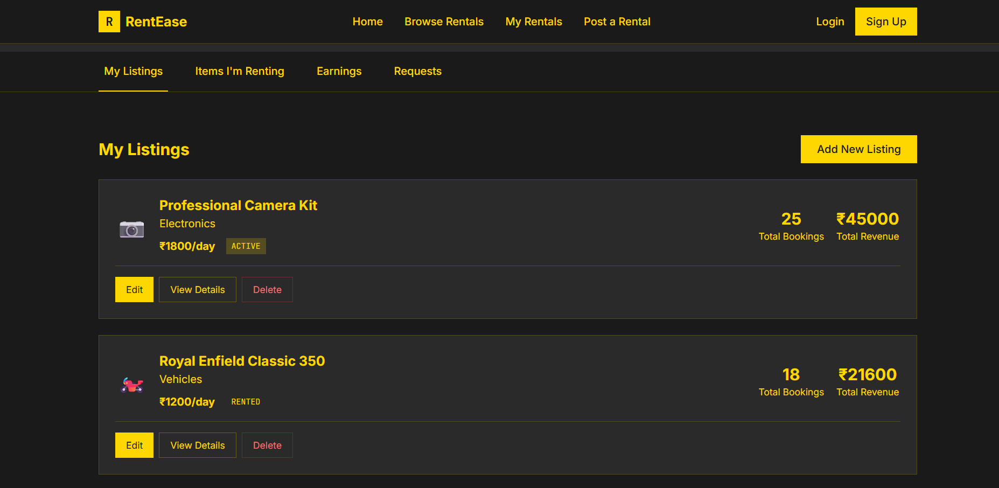
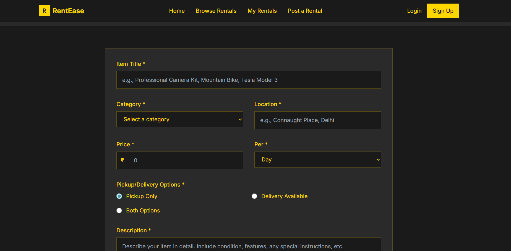

# RentEase - Full Stack Application

A modern rental platform built with React frontend and Django backend.

## Screenshots

*Homepage with modern dark theme and yellow accents*

 
*Browse and search through available rental properties*

*Detailed property view with booking options*

## Project Structure

\\\
RentEase/
 frontend/          # React + Vite frontend
    src/
    public/
    package.json
    ...
 backend/           # Django REST API backend
    rentease_backend/
    requirements.txt
    ...
 README.md         # This file
\\\

## Quick Start

### Frontend (React)
\\\ash
cd frontend
npm install
npm run dev
\\\

### Backend (Django)
\\\ash
cd backend
pip install -r requirements.txt
python manage.py migrate
python manage.py runserver
\\\

## Tech Stack

### Frontend
- React 18 with Vite
- Redux Toolkit + React Query
- Tailwind CSS + Radix UI
- React Router DOM
- React Hook Form + Zod validation

### Backend (To be implemented)
- Django + Django REST Framework
- JWT Authentication
- PostgreSQL/SQLite Database
- Django CORS Headers

## Development

1. Start Django backend on \http://localhost:8000\
2. Start React frontend on \http://localhost:5173\
3. Frontend will communicate with backend via REST APIs

## Environment Variables

### Frontend
Create \rontend/.env\:
\\\
VITE_API_BASE_URL=http://localhost:8000/api
\\\

### Backend
Create \ackend/.env\:
\\\
SECRET_KEY=your_secret_key
DEBUG=True
DATABASE_URL=sqlite:///db.sqlite3
\\\

## Next Steps

- [x] Remove Firebase dependencies
- [x] Set up project structure
- [ ] Create Django backend
- [ ] Implement authentication APIs
- [ ] Implement house/rental APIs
- [ ] Connect frontend to backend APIs
